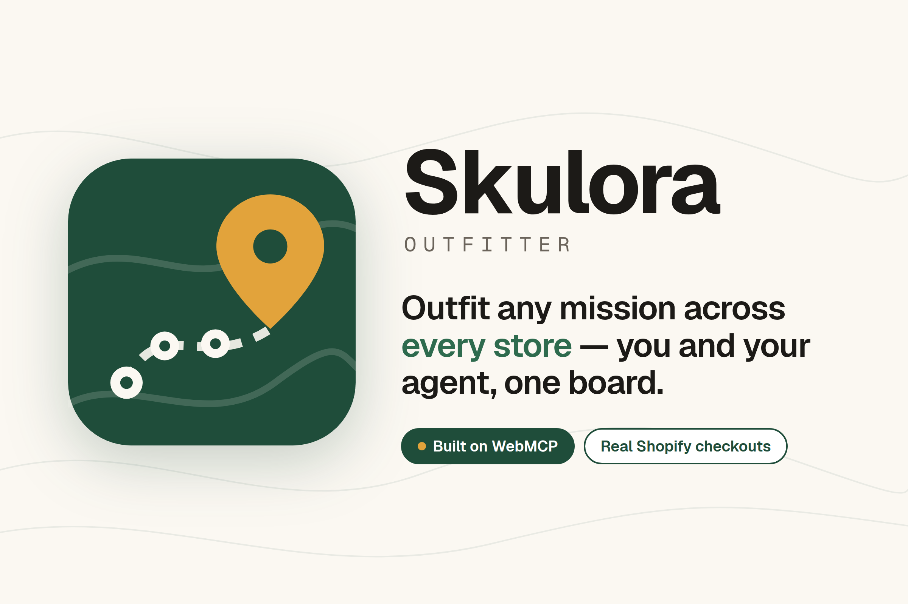
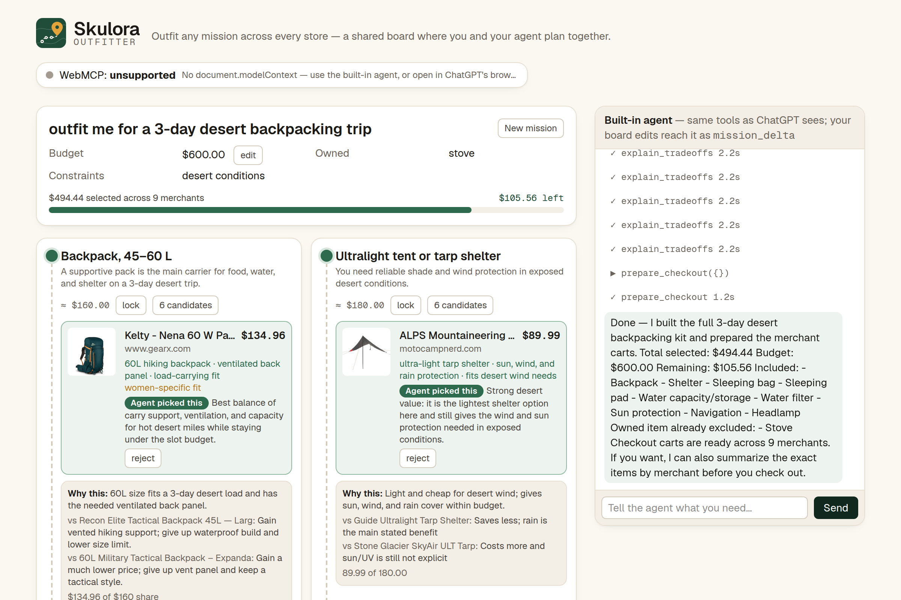
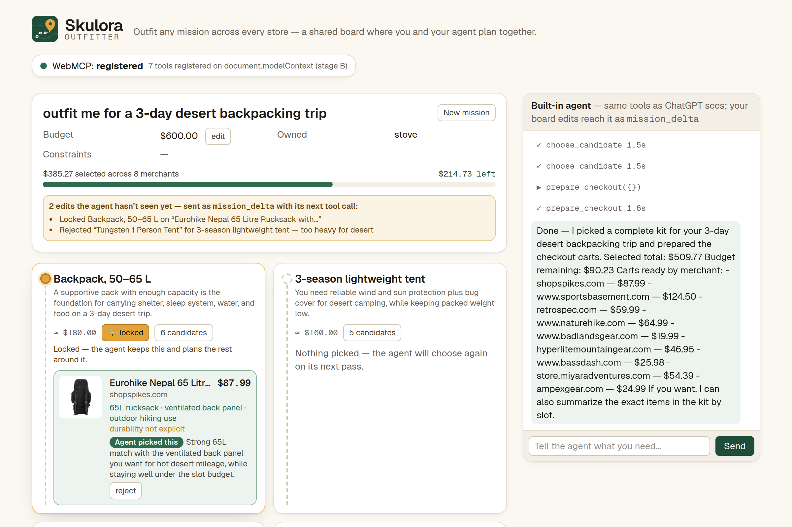
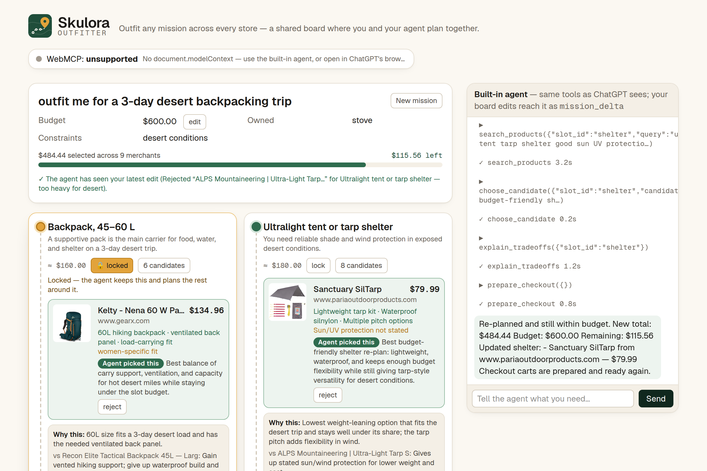
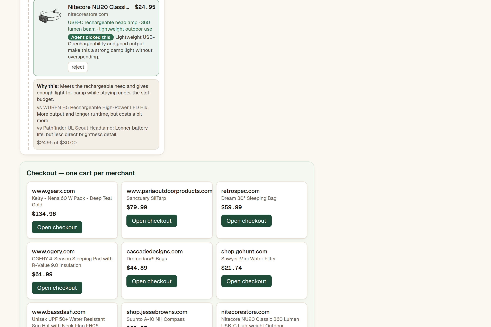
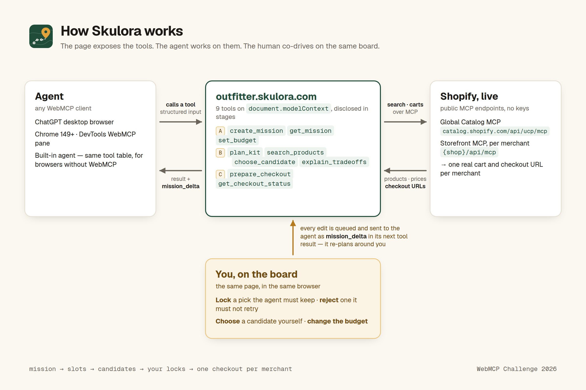

# Skulora Outfitter

**Outfit any mission across every store.**

A shared planning board where a person and their agent plan a shopping **mission** together — *"outfit me for a 3-day desert backpacking trip, under $600, I already own a stove"* — across real Shopify merchants, ending in one real checkout link per merchant.

Built for [The WebMCP Challenge](https://webmcp.devpost.com/). Every capability the agent uses is a tool this page registers with `document.modelContext.registerTool(...)`. The human works on the same board in the same browser; every edit reaches the agent as `mission_delta` in its next tool result.

**Live:** <https://outfitter.skulora.com> · **Video (2:55):** <https://youtu.be/La2AGaUZurA> · MIT licensed

[](https://outfitter.skulora.com)

## Try it (judges) — 5 steps, ~3 minutes

1. Open **<https://outfitter.skulora.com>** in **ChatGPT's desktop browser** (GPT-5.6 Sol/Terra) or in **Chrome 149+** with `chrome://flags/#enable-webmcp-testing` enabled. The pill top-right turns green: *WebMCP: registered*.
2. Ask the agent: *"Outfit me for a 3-day desert backpacking trip. Budget $600. I already own a stove and a headlamp. I run hot at night."*
3. Watch the board fill. The agent creates the mission, **discovers the next-stage tools** (`plan_kit`, `search_products`, …) as they appear, plans the slots, searches merchants in parallel, and picks each item with a reason you can read on the card.
4. **Lock** one pick you want to keep, **reject** one you don't, then say *"I changed some things — re-plan within budget."* The agent reads your edits from `mission_delta` and replaces only what you rejected.
5. Ask for checkout. `prepare_checkout` creates one real cart per merchant and puts a **Checkout** link on the board. Chrome: DevTools → Application → **WebMCP** shows the tools and the invocation log.

No login. Carts are created on real merchants but nothing is purchased — checkout is always your step. Any browser without WebMCP can use the **built-in agent** panel on the page; it drives the identical tool table.

## Why WebMCP for this

- **Fit.** A mission is structured state with a small set of operations: plan, search, choose, explain, prepare. Exposing it as typed tools lets any agent finish the job faster and more reliably than guessing through a UI, while the page decides what an agent may do.
- **Better experience.** One sentence — *"outfit me for a 3-day desert trip, $600, I own a stove"* — becomes a 9-slot kit searched across every merchant and chosen with reasons in 27 seconds (`g3.json`), instead of eight store searches, a spreadsheet for the budget and a dozen tabs. The person never re-explains: locks and rejections reach the agent as data.
- **Together.** The agent does the breadth (every merchant, every slot); the person does the judgment (this one, not that one, this much). Lock a pack, reject a tent, say "re-plan": the agent keeps the pack, replaces only the tent and says why.
- **How.** Nine typed tools registered with `document.modelContext.registerTool(...)`, disclosed in three stages via `toolchange`, annotated (`readOnlyHint`, `untrustedContentHint`), results sized for an agent's context, `mission_delta` and `next_suggested_tools` in every result, and every rule enforced on the server with errors that name the valid ids and the next tool. Details below.

## What a run looks like

Numbers below come from `harness.json` (`pnpm harness`, mission #1), `evidence.json` (`pnpm probe --carts`) and `g3.json` (`pnpm g3`), never typed by hand.

- Plan: **8 slots** in 5.9 s. Search: 2.1–3.1 s per slot, 4 candidates each, sourced from Shopify's Global Catalog plus tagged merchants.
- Kit: **$552.90 of a $600 budget across 6 merchants** (Kaviso, Naturehike, Uloha, Campmor, Garage Grown Gear, Cotopaxi), no required slot unfilled.
- `explain_tradeoffs` for all slots: 892 bytes, so it fits an agent's context budget.
- Merchant probe: **7/7** Storefront MCP endpoints reachable, Global Catalog OK, real cart + checkout URL created on Allbirds.
- Co-driving run on production (`g3.json`): **9/9 slots filled in 27 s**; after a lock and a reject, the locked pick kept, the rejected pick replaced, every other slot untouched; 9 carts created, 8 checkout links live.

| The kit, planned by the agent | Lock + reject on the board |
|---|---|
|  |  |

| Re-plan: the agent sees `mission_delta` | One real checkout per merchant |
|---|---|
|  |  |

## How it works



```text
mission → slots → candidates → your locks → one checkout per merchant
```

### WebMCP surface

`src/lib/webmcp/tools.ts` is the single tool table; `src/components/WebMCPTools.tsx` registers it with `document.modelContext.registerTool(...)` (with `AbortController` cleanup). Tools are disclosed in **stages** as the mission advances, so the agent sees a small, relevant set at every step and re-discovers via `toolchange`:

| Stage | Tools | Notes |
|---|---|---|
| A — no mission yet | `get_mission`, `create_mission`, `set_budget` | `get_mission` is `readOnlyHint` |
| B — mission exists | `plan_kit`, `search_products`, `choose_candidate`, `explain_tradeoffs` | `search_products` carries `untrustedContentHint` (merchant content); `explain_tradeoffs` is `idempotentHint` |
| C — every required slot filled | `prepare_checkout`, `get_checkout_status` | one real cart per merchant |

Every result ends with three fields the agent can act on:

- `mission_delta` — the person's edits since *this agent's* last call (locks, rejects, manual choices, budget changes). `choose_candidate` fails on a locked slot or a rejected candidate, so the agent has to read it.
- `stage` and `next_suggested_tools` — what to do next, computed from the board's actual state.

Descriptions stay within Chrome's guidance (names ≤ 30 chars, descriptions ≤ 500, results ≈ ≤ 1.5 KB).

### Guardrails for careless agents

Agents call tools out of order, in parallel, with stale ids, and while the person is editing. The board is built to stay coherent anyway; `pnpm misuse` drives every case below through `document.modelContext.executeTool` in headless Chrome (36 checks):

- Every mutation is validated on the server; an error names the valid slot or candidate ids and the tool to call next, so the agent recovers on its next turn.
- `create_mission` on a board that already has picks is refused unless `replace: true`; the error points to `set_budget` and `plan_kit` for adjustments.
- Re-planning keeps every slot the person locked **or chose in**, and tells the planner those needs are covered.
- Carts are derived state: any change to a pick clears them (`checkout_reset` on the event log), so a stale checkout never sits under a new pick. `prepare_checkout` is refused while a required slot is empty, naming the slot.
- Tool stages only ever advance within a mission. Un-registering tools under an in-flight call made Chrome report a call as failed after it ran.
- `merchant_domain` is checked against the curated merchants and sellers already on the board before the server contacts any host.
- Parallel tool results are adopted by version, so a late, older reply cannot blank candidates the board already shows.

### Behind the tools

- `src/app/api/missions/**` — server-side missions in Upstash Redis with compare-and-set writes, because agents call `search_products` for every slot in parallel. Slow work (LLM, merchant search) runs outside the mutation.
- `src/lib/mission/planner.ts` — mission → slots, strict-schema structured output.
- `src/lib/mission/search.ts` — fan-out over Shopify's **Global Catalog MCP** (`catalog.shopify.com/api/ucp/mcp`) and each merchant's **Storefront MCP** (`{shop}/api/mcp`), dedupe, LLM re-rank with a fit threshold.
- `src/lib/mission/checkout.ts` — `update_cart` on each merchant's Storefront MCP → cart id + checkout URL. Sold-out variants surface as a merchant error on the card, not a silent failure.
- `src/app/api/agent/route.ts` + `src/components/AgentPanel.tsx` — the built-in agent (function calling over the same table), for browsers without WebMCP.
- `src/lib/ratelimit.ts` — per-IP limits on the endpoints that spend money or write (LLM steps, mission actions, new missions); reads are never limited. Keeps the site free and open through the judging window.

### Real merchants, public APIs

Product search and carts use Shopify's public, unauthenticated Storefront MCP and Global Catalog MCP endpoints, which merchants expose for agents. The agent profile the Catalog requires is self-hosted at `/ucp/agent-profile.json`. Carts are ordinary abandoned carts with no personal data; the app never completes a purchase.

## Develop

```bash
pnpm install
cp .env.example .env.local   # add an LLM key (OpenAI or Anthropic)
pnpm dev                     # missions are in-memory unless KV_REST_API_URL is set
pnpm probe --carts --burst   # merchant + Global Catalog checks, one real cart, rate-limit burst → evidence.json
pnpm harness                 # six canned missions end to end → harness.json
pnpm g3                      # 3 consecutive co-driving runs on production, checkout links opened in Chrome → g3.json
pnpm misuse                  # drives the tools out of order in flagged headless Chrome against a local dev server (36 checks)
pnpm gallery                 # regenerates docs/gallery from the live site
```

Chrome without ChatGPT: enable the flag, open the page, and run tools by hand from DevTools → Application → WebMCP, or ask the built-in agent panel.

## License

MIT — see `LICENSE`. Third-party material: `THIRD_PARTY.md`.
